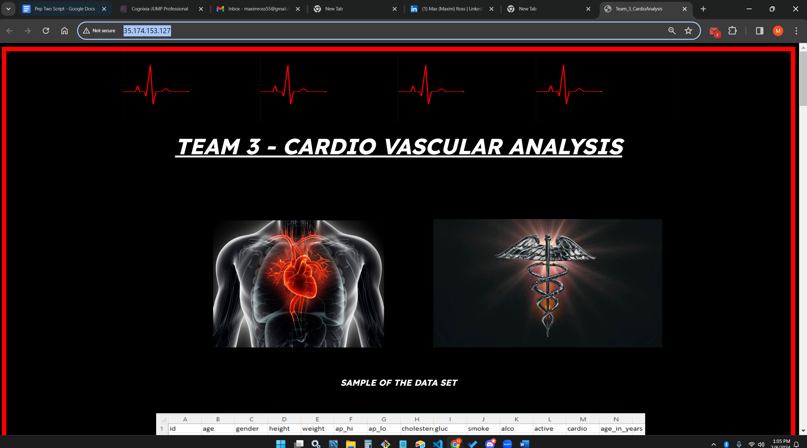

---
runme:
  id: 01HP2GFKW918YRHV8BZ3X3K7M1
  version: v2.2
---

# Patient_AWS_pipe

Designing an ETL pipeline in AWS using S3, RDS, Lambda (Python), and Kaggle data

by Finn Mikkola, Jason Fearnall & Max Ross

[Kaggle Data Source](https://www.kaggle.com/datasets/sulianova/cardiovascular-disease-dataset)

## Our EC2 hosted Webpage:

