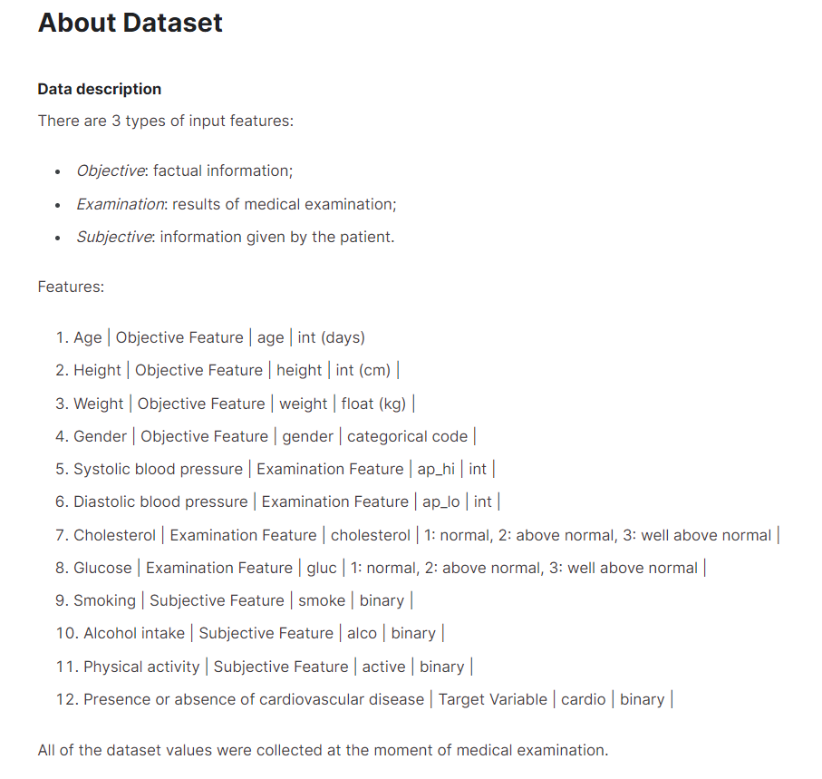

# Patient_AWS_pipe

#### Designing an ETL pipeline in AWS using S3, RDS, Lambda (Python), EC2 and Kaggle data

by: Finn Mikkola, Jason Fearnall & Max Ross

[Kaggle Data Source](https://www.kaggle.com/datasets/sulianova/cardiovascular-disease-dataset)

